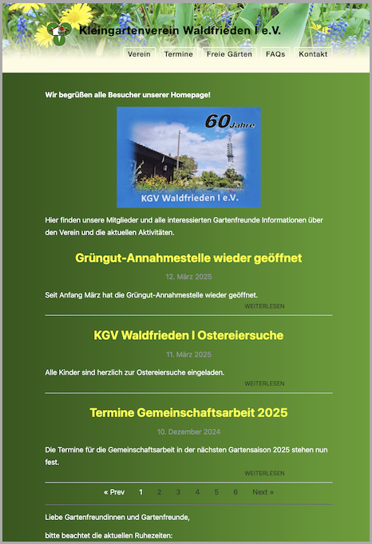
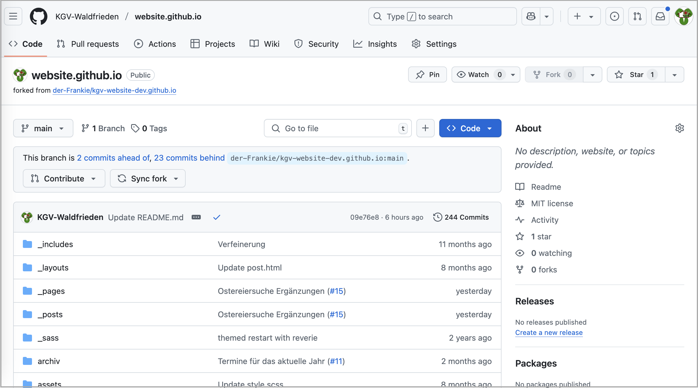
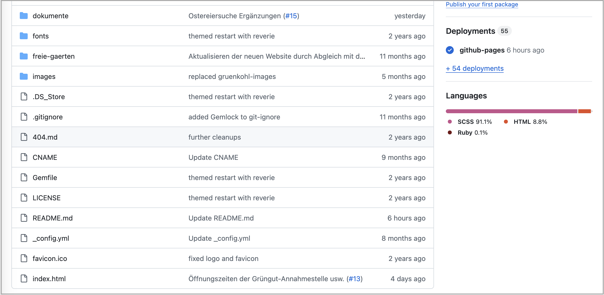
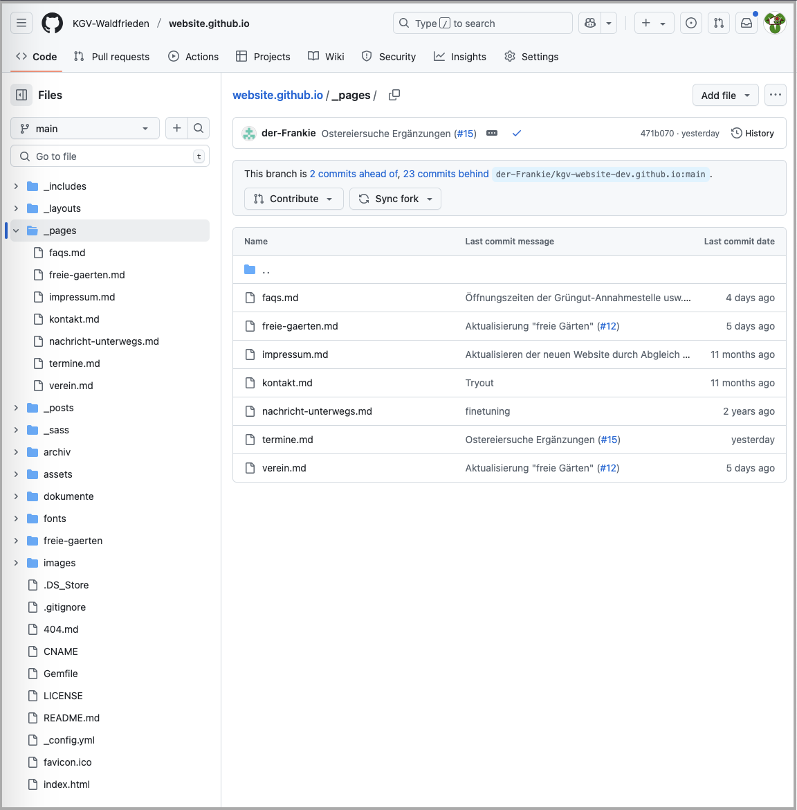
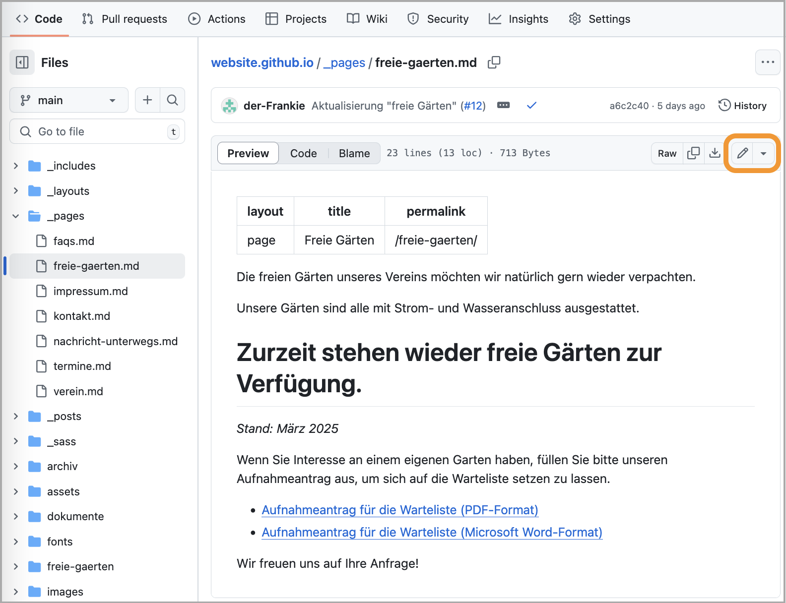
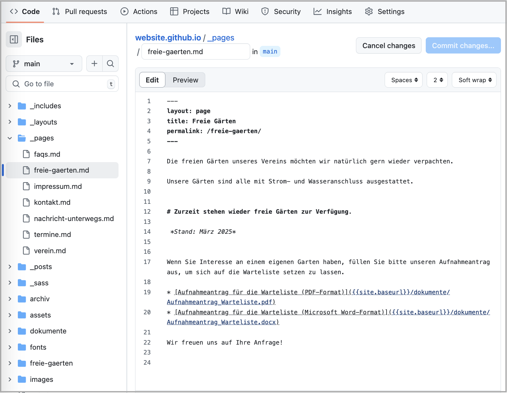
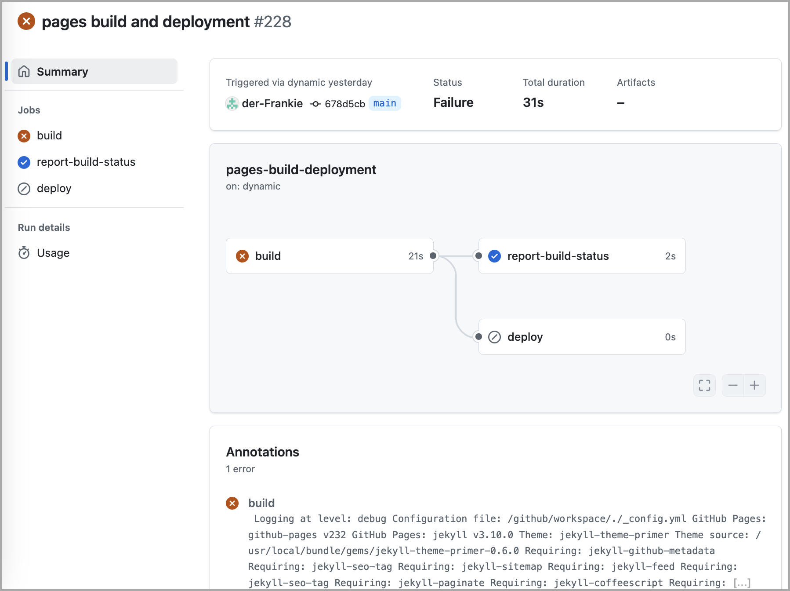

# Anleitung für die Website und deren Bearbeitung

Stand: 17. März 2025

Dieses Dokument umfasst eine Beschreibung der Website des KGV Waldfrieden e.V. I und eine Anleitung zur Bearbeitung.

- - - - - - - - - - - - - - - - - - - - - - - - - - - - - -

## Technologie-Überblick

Bei diesem Projekt handelt es sich um eine statische Website, d.h. alle Inhalte und Elemente der Website lieben auf einem Webserver vor und werden nicht erst beim Aufruf erzeugt.

Die Inhalte liegen primär im Format Markdown vor und in einem (öffentlich sichtbaren) Repository auf [GitHub](https://github.com/), sind aber nur als registrierter und berechtigter User bearbeitbar.

Bei GitHub ([Wikipedia-Link](https://de.wikipedia.org/wiki/GitHub)) handelt es sich um einen [Onlinedienst](https://de.wikipedia.org/wiki/Onlinedienst "Onlinedienst") zur gemeinschaftlichen [Softwareentwicklung](https://de.wikipedia.org/wiki/Softwareentwicklung "Softwareentwicklung") und [Versionsverwaltung](https://de.wikipedia.org/wiki/Versionsverwaltung "Versionsverwaltung") für Softwareprojekte. Und da eine Website auf Software basiert, bietet sich dieser Dienst zur Verwaltung an.

Technisch basiert die Website auf [GitHub Pages](https://pages.github.com/) und dem Framework [Jekyll](https://jekyllrb.com/). Jekyll ist ein sogenannter _Static (Web-)Site Generator_ ([Wikipedia-Link](https://en.wikipedia.org/wiki/Static_site_generator)) - das bedeutet, mittels dieses Werkzeugs werden aus Text-basierten

GitHub Pages ([Wikipedia-Link](https://de.wikipedia.org/wiki/GitHub#GitHub_Pages)) bietet die Möglichkeit, statische (Website-)Inhalte im Internet zur Verfügung zu stellen ([Wikipedia-Link](https://de.wikipedia.org/wiki/Webhosting)) und ergänzt damit die Werkzeugkiste für unseren Anwendungsfall hervorragend.

- - - - - - - - - - - - - - - - - - - - - - - - - - - - - -

## Strukturen der Website

Auf die Website gibt es zwei strukturell unterschiedliche Sichtweisen.

### 1. Der Aufbau der Website und deren Inhalte

Die Website basiert auf einem veränderlichen Layout ("responsive design"), das sich an die Fenstergröße bzw. das verwendete Bildschirmgerät dynamisch anpasst.

 

Auf der Startseite (der sog. '_Landing page_') werden die jüngsten drei Posting-Auszüge angezeigt (das jeweils vollständige Posting ist durch Klick auf '_WEITERLESEN_' erreichbar) und die übrigen Posting-Sites sind über die sogenannte '_Pagination_' (zu dt. "Seitenzählung") verlinkt.

Die jeweiligen Unterseiten (Verein, Termin, Freie Gärten, FAQs, Kontakt) sind mittels der im oberen Bereich der Seite angeordneten Menü-Buttons direkt erreichbar.

Im _Footer_-Bereich der Website finden sich außerdem noch die Links mit der Mail-Adresse und zum Impressum.

#### Hierarchischer Aufbau (inkl. Inhalte) im Überblick

- Logo und Name des Kleingartenvereins
- Menü
	- Verein
		- Technische Daten zum Vereinsgebiet
		- Lage des Vereins
		- Vereinssatzung
		- Der Vorstand und die Beisitzer
		- Geschäftsführung der SWG (Strom- und Wassergemeinschaft)
		- Geschichte des Vereins
		- Dokumente (Links)
	- Termine
		- Termine des laufenden Kalenderjahres
		- Links auf die archivierten Termine der vergangenen Jahre
	- Freie Gärten
		- Info ob freie Gärten verfügbar
		- Hinweis & Links auf Aufnahmeantrag für Warteliste
	- FAQs (Frequently Asked Questions = Häufige Fragen)
		- Kehrung der Schornsteine
		- Grüngut-Annahmestelle
	- Kontakt
		- Kontaktformular
		- Hinweise zum Datenschutz
- Inhalt / Content
	- Startseite
		- Begrüßung
		- Posting-Auszüge (aktuell: 3)
		- Info zu Ruhezeiten
	- sonstige Seiten
		- jeweiliger Inhalt
- Footer
	- Mail-Link
	- Impressum-Link

### 2. Die Projektseite auf GitHub

Es gibt einen GitHub-Account '**KGV Waldfrieden**' und auf der entsprechenden GitHub-Seite ( https://github.com/KGV-Waldfrieden ) diese zwei Repositories:

1. Das Repository '**website.github.io**' enthält die Verzeichnisse und Dateien für die Website. Die Bezeichnung des Repository ist auf die Namenskonventionen für '_GitHub Pages_' zurückzuführen.
	- https://github.com/KGV-Waldfrieden/website.github.io

	

2. Ein weiteres Repository '**howto-website**' enthält die vorliegende Dokumentation.
	- https://github.com/KGV-Waldfrieden/howto-website

#### Repository-Site

Für die Bearbeitung ist primär nur die Seite mit der '_Code_'-View relevant.

##### Verzeichnisbaum

Die Inhalte KGV-Website basieren auf den Inhalten der Verzeichnisse und Dateien, die in diesem Verzeichnisbaums organisiert sind. Die folgenden Abschnitte bieten eine kurze Beschreibung der hier primär relevanten Inhalte.

##### Pages-Verzeichnis

Die Pages sind die Inhaltsseiten der Website und sind (bis auf eine Ausnahme) direkt von der Startseite (_Landing page_) über die Menü-Leiste oder den Impressum-Link im Footer erreichbar.

##### Posts- / Postings-Verzeichnis

Postings sind einzelne News oder auch Informationen, bei denen Aktualität und kurzfristige Relevanz im Vordergrund steht. Aktuell haben wir die jeweils drei aktuellsten (die jüngsten bis einschließlich heute) auf der Startseite direkt als Auszug eingebunden und verlinkt.

Es können auch bereits zukünftige Postings erstellt werden - diese werden aber erst mit Erreichen des entsprechenden Datums auf der Startseite angezeigt.

##### Bilder-Verzeichnis

In diesem Ordner sind alle Bilder, Fotos oder auch Grafiken (i.d.R. mit den Dateiendungen 'jpg', 'gif' oder 'png') abgelegt, die irgendwo auf der Website eingebunden werden. Um diese *Images* einzubinden, müssen diese selbstverständlich via **commit** Teil des _Repositories_ werden.

##### Dokument-Verzeichnis

Da auf der Website verschiedene Dokumente in verschiedenen Formaten (PDF, Word: doc/docx), aber auch als Bilddatei zur Verfügung stellen, gibt es dafür einen zentralen Ablageort. Auch für die Dokumente gilt: Um die einzubinden, d.h. auf der Website zu verlinken und auch anzuzeigen, müssen diese mittels **commit** Teil des _Repositories_ werden.

##### Die Datei 'index.html'

Diese Datei ist per Konvention im WWW die Startseite einer Website - und so ist es auch hier. Im Gegensatz zu den ansonsten zu bearbeitenden Dateien liegt diese im HTML-Format ([Wikipedia-Link](https://de.wikipedia.org/wiki/Hypertext_Markup_Language)) vor. Wie auch das Markdown-Format ist es zwar Text-basiert, enthält aber erheblich mehr *Auszeichnungen*, die die Struktur und Gestaltung der Seite betreffen und das Lesen erschweren. Beim Blick in die Datei finden sich sämtliche Inhalte, die auf der Startseite der Website zu sehen sind, wieder.

##### Weitere Dateien und Verzeichnisse

Die übrigen Verzeichnisse und Dateien sind selbstverständlich für die Website auch relevant, weil dort Konfigurationen und beispielsweise Schriften o.ä. enthalten sind. Aber in der Regel sind dort keine Änderungen notwendig - und definitiv auch nur angeraten, wenn man weiß, was man da tut.

- - - - - - - - - - - - - - - - - - - - - - - - - - - - - -

# Anleitung zur Bearbeitung

Die Bearbeitung der Website folgt einem immer gleichen Schema.

| Phase     | Beschreibung                                |
| --------- | ------------------------------------------- |
| Edit.     | Bearbeiten oder Hinzufügen von Inhalten.    |
| Commit.   | Übergeben der Änderungen an das Repository. |
| Workflow. | Automatisierte Verarbeitung.                |
| Publish.  | Veröffentlichung (als GitHub-Page).         |

## Die Bearbeitungs-Phase

Die initiale Sicht auf das Repository zeigt die '_Code_'-Ansicht mit dem bereits angesprochenen Verzeichnisbaum.

Ein Klick auf ein Verzeichnis innerhalb des Verzeichnisbaums öffnet das Verzeichnis (ähnlich wie z.B. ein Datei-Manager in Windows) und zeigt die folgende Ansicht:

Nun wird es bezüglich der Bearbeitung konkreter: Ein Klick auf die Datei '**freie-gaerten.md**' im gerade geöffneten Verzeichnis öffnet diese Datei.

Die Datei wird in der '_Preview_'-Ansicht angezeigt. Diese Ansicht ähnelt stark dem, was auch auf der Website im Internet zu sehen ist. Ein Klick auf des Stift-Symbol (orange Markierung oben rechts auf der Abbildung) öffnet die '_Edit_'-Ansicht.

Jetzt sind wir im '_Edit_'-Modus. Hier sehen wir jetzt die Text-Inhalte unserer ausgewählten Seite "Freie Gärten" mit den Markdown-Formatierungen.

Hier können nun Änderungen oder Ergänzungen durchgeführt werden. Die Auswirkung dieser Änderungen können gefahrlos im '_Preview_'-Modus gesichtet werden.

Ein Wechsel ist mit dem entsprechenden Schalter problemlos möglich.

### Exkurs: Markdown

Alle Texte auf der Website sind mittels _Markdown_ formatiert. Das bietet den großen Vorteil, dass der Text selbst lesbar bleibt und daraus über einen (in einem späteren Abschnitt beschriebenen) automatisierten Workflow die komplett formatierte Website generiert und veröffentlich werden kann.

[Markdown](https://de.wikipedia.org/wiki/Markdown) ist eine Auszeichnungssprache, mit der sich Texte auf einfache Art formatieren lassen. Einen guten Überblick über den [Einstieg in das Schreiben auf GitHub] bietet die verlinkte Site. Dort wird ein eingehenderes Verständnis ermöglicht, während der Unterabschnitt [Grundlegende Schreib- und Formatierungssyntax](https://docs.github.com/de/get-started/writing-on-github/getting-started-with-writing-and-formatting-on-github/basic-writing-and-formatting-syntax) als kompakte Referenz dienlich sein kann.

### Bilder und Dokumente

[...]

- - -
TODO:  Einbindung von Bildern und Dokumenten beschreiben!
- - -

## Die 'commit'-Phase

Änderungen brauchen nur mittels '_commit_' in das GitHub-Repository übergeben zu werden (vom Verständnis her ähnlich wie das 'speichern' unter Windows). Führt man die Änderungen direkt innerhalb von GitHub durch, ist ansonsten keine weitere Aktion notwendig und es wird automatisch die nächste Phase gestartet: der automatisierte '_Workflow_'.

[...]

- - -
TODO: detailierter Beschreibung.
- - -

## Die Workflow-Phase

Die Erzeugung der Website ist in GitHub über einen '_Workflow_' (basierend auf '_Actions_') automatisiert und wird automatisch gestartet, wenn ein '_commit_' in das Website-Repository registriert wird.

Dazu werden die Inhalte im Repository und die vorhandenen Konfigurationen durch das Jekyll-Framework verarbeitet und im Hintergrund ein sogenannte '_Build_'-Prozess ausgeführt, der daraus die statischen Daten für die Website neu erzeugt. In der Regel läuft ein solcher Prozess ohne Probleme durch.

## Die Publish-Phase

Innerhalb dieser Phase werden die neu erzeugten Inhalte auf einem Webserver bereitgestellt und damit im Internet veröffentlicht.

Ein erfolgreicher '_Build_'-Prozess stellt die neu generierten Dateien so zur Verfügung, dass diese direkt auf einer '_GitHub Page_' veröffentlicht werden können. Das Ergebnis kann dann dort unter der URL https://kgv-waldfrieden.github.io/website.github.io/ und natürlich unter der bekannten Adresse der KGV-Homepage im Internet (https://www.kgv-waldfrieden-hannover.de) angeschaut werden.

Kommt es während des '_Build_'-Prozesses zu Fehlern, findet keine Veröffentlichung statt. Damit ist gewährleistet, dass es durch kleinere Fehler nicht zu einer "kaputten Website" kommen kann. Hinweise bzgl. der Kontrolle und Fehler-Recherche werden im Anhang weiter beschrieben.

- - - - - - - - - - - - - - - - - - - - - - - - - - - - - -

# Anhang

## Kontrolle des Build-Prozesses

Falls erforderlich gibt es eine Möglichkeit, Details über den _Build_-Prozess (den sog. automatisierten '_Workflow_') angezeigt zu bekommen.

Im Menü auf der Repository-Site gibt den Punkt _Actions_ und ein Klick darauf führt auf die Übersichts-Site '__Actions - All workflows__'.

Die Übersicht im rechten unteren Bereich listet die jeweils letzten _Build_-Prozess (mit Status, Startzeitpunkt, Dauer usw.) auf. In der obigen Abbildung sind die (sichtbaren) letzten beiden Build-Prozesse mit dem Status '_completed_' geendet - und so sollte es in aller Regel auch sein.

Ein Prozess, der aktuell noch andauert, hat den Status '_in progress_' und ist mit einem gelben Kreisel-ähnlichen Symbol gekennzeichnet.

## Vorgehen im Fehlerfall

### Recherche

Wird ein Prozess-Lauf mit Fehlern beendet (Status '_failure_'), wird dieser mit einem roten Kreis markiert.

In einem solchen Fall kann ein Blick in die Einzelheiten des Prozesses weiterhelfen.
Ein Klick auf '_pages build and deployment_' führt auf die _Summary_ (Zusammenfassung) des Vorgangs.

Die dort angezeigten _Annotations_ (Ausgaben) erfordern allerdings bereits ein tieferes Verständnis des _Build_-Prozesses und sind hier nur zur Information aufgezeigt.

### Bugfix oder 'Zurück auf Los'

- Änderungen können einfach gesichtet und korrigiert oder rückgängig gemacht werden.
- Wie mache ich die Änderungen einfacher sichtbar?

[...]

- - -
TODO:  Details beschreiben!
- - -

- - - - - - - - - - - - - - - - - - - - - - - - - - - - - -
